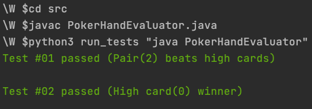

# Three Card Poker Judger

This program judges a game of three-card poker. The program aims to find the winning player and return their id.

## How to run and test

### Requirement: 

- Java 8
- Python3

### Source Code:

- `Card.java`

- `Hand.java`
- ` PokerHandEvaluator.java`


### Step 1: Change directory to source

```
cd src
```

### Step 2: Compile the code

```
javac PokerHandEvaluator.java
```

### Step 3: Run the tests
```
python3 run_tests "java PokerHandEvaluator"
```


 

## Program Design

I used Object Oriented Design and Programming to implement the Three Card Poker Judger. I defined three classes `Card`, `Hand`, and `PokerHandEvaluator` to encapsulate corresponding data. 

- `Card.java`

  Card class includes two attributes: `<rank><Suit>` . I used a HashMap to interpret the rank from Character to Integer to make it more convenient to compare face values. I used the enum Suit to record the suits of the cards.

- `Hand.java`

  Hand class is a collection of cards. In this case, the size is three. It contians four attributes: `<Card[]><id><Type><score>` . The cards are sorted in ascending order by rank. A unique id is assigned to the player, which will be returned as output if winning the game.  I used enum Type to mark the types of hands with different priorities. So in the scoring system for the rank rule, a more prioritized type has more weight. The `calScore` function calculates the score for the hand and stores it in the score field of the hand objects. 

- `PokerHandEvaluator.java`

  The input gets converted into an array of hands to evaluate. The PokerHandEvaluator class will determine the hand Type and compare the hand score based on the soring system to select the winners.

  

### Program Limitations

- The poker game is not restricted to one standard 52-card deck because there is no check on the duplicate card of the same rank and suit.
- If the program is scalable to more cards like a five or seven cards poker game, it would be better to implement a comparator in the  PokerHandEvaluator class.
- Each input file must have at least one player and no more than eight players in each game. No player or more than eight players will throw an IllegalArgumentException.
- Each player has only one hand to play the game. Having duplicate player ids will trigger an IllegalArgumentException.

